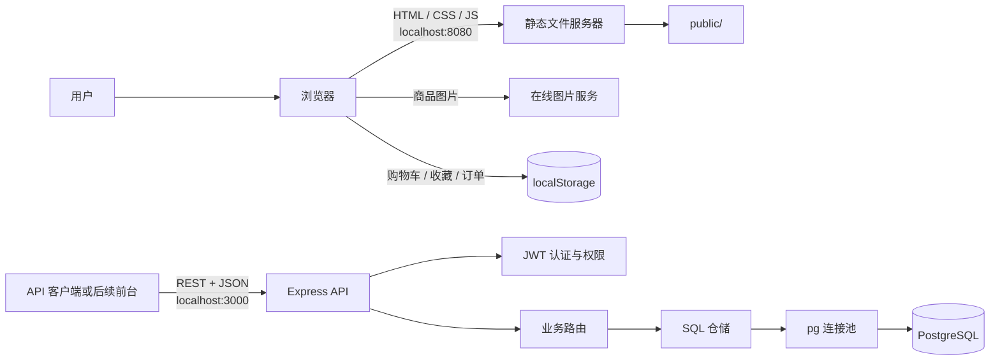
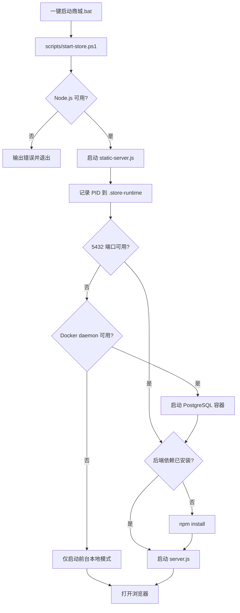
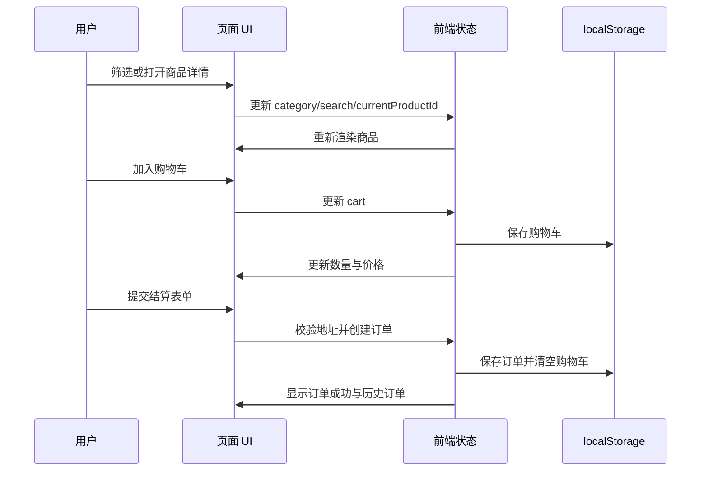
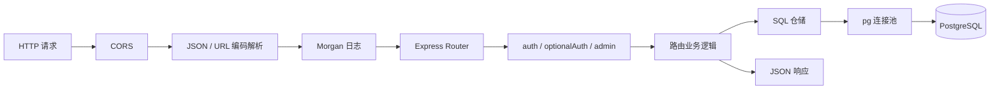
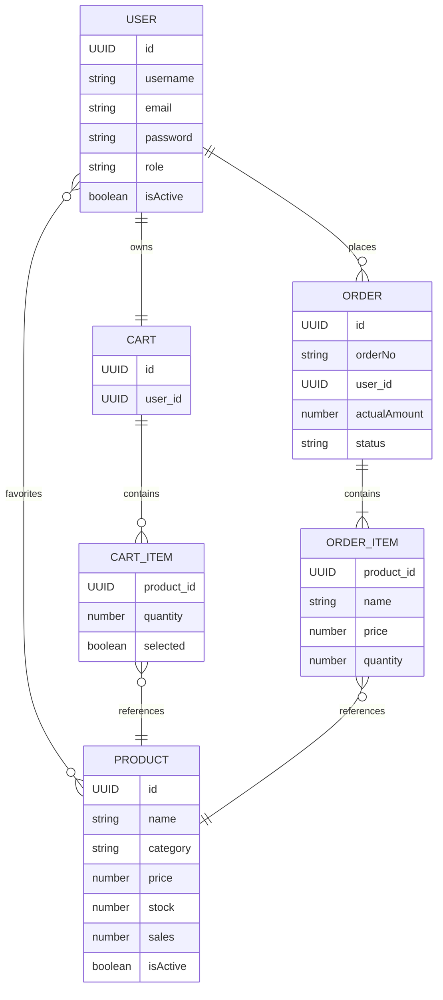

# 项目架构

本文描述古德因纳夫商城当前代码的真实结构、运行边界和主要数据流。

## 1. 架构概览

项目由三个相对独立的部分组成：

1. 商城前台：原生 HTML、CSS 和 JavaScript，当前使用内置商品数据与 `localStorage`。
2. 静态服务器：Node.js 原生 HTTP 服务，负责从 `public/` 提供前端资源。
3. 可选后端：Express REST API，通过 `pg` 连接池和参数化 SQL 访问 PostgreSQL。

当前商城首页没有调用 Express API。即使 API 已启动，前台的购物车、收藏和订单仍保存在当前浏览器中。



## 2. 运行时拓扑

| 组件 | 默认地址 | 是否必需 | 职责 |
| --- | --- | --- | --- |
| 商城前台 | `http://localhost:8080` | 是 | 页面展示与完整本地购物流程 |
| Express API | `http://localhost:3000` | 否 | 认证、商品、购物车和订单接口 |
| PostgreSQL | `localhost:5432/goodenough` | API 必需 | 持久化后端业务数据 |
| 在线图片服务 | HTTPS | 是 | 生成并返回商品与场景图片 |

Windows 启动链路：



关闭脚本读取 `.store-runtime/processes.json`，校验 PID 与进程启动时间后再终止进程，避免误关 PID 已被复用的其他程序。由启动脚本创建的 PostgreSQL 容器也会停止，但 Docker Volume 数据不会删除。

## 3. 前端架构

### 3.1 文件职责

| 文件 | 职责 |
| --- | --- |
| `public/index.html` | 页面语义结构、抽屉、弹窗和表单容器 |
| `public/styles.css` | 设计变量、布局、响应式规则和基础动效 |
| `public/motion.css` | 滚动进度、顶栏隐藏、入场编排、商品卡倾斜光泽等增强动效 |
| `public/script.js` | 商品数据、页面状态、渲染、购物流程与事件绑定 |
| `public/motion.js` | 滚动驱动 UI、数字滚动、飞入购物车、收藏爆裂等动效系统 |

### 3.2 状态模型

`public/script.js` 维护单一页面状态对象：

```text
state
|-- category          当前商品分类
|-- search            搜索词
|-- sort              排序方式
|-- favoritesOnly     是否仅显示收藏
|-- visibleCount      当前展示数量
|-- currentProductId  详情弹窗中的商品
|-- coupon            当前优惠码
|-- cart              购物车商品与数量
|-- favorites         收藏商品 ID
`-- orders            本地历史订单
```

页面初始化顺序：


### 3.3 购物流程



关键设计约束：

- 商品数据目前定义在 `public/script.js`，不是从数据库读取。
- 金额、优惠和运费均在浏览器端计算，只适合演示环境。
- 页面刷新后从 `localStorage` 恢复购物车、收藏和订单。
- 图片地址由统一的 `imageUrl()` 方法生成，并带失败兜底。
- UI 采用事件委托处理动态商品卡片和购物车条目。

## 4. 后端架构

### 4.1 请求处理链路



路由负责 HTTP 参数与响应，仓储负责参数化 SQL、字段序列化和事务。项目没有单独的 controller 或 service 层；复杂的订单一致性逻辑位于订单仓储中。

### 4.2 模块边界

| 路由前缀 | 文件 | 主要职责 |
| --- | --- | --- |
| `/api/auth` | `server/routes/auth.js` | 注册、登录、资料、密码与收藏 |
| `/api/products` | `server/routes/products.js` | 商品查询、搜索与管理员增删改 |
| `/api/cart` | `server/routes/cart.js` | 购物车增删改、选择与优惠码校验 |
| `/api/orders` | `server/routes/orders.js` | 下单、查询、取消、确认收货与状态管理 |
| `/api/health` | `server/server.js` | 服务健康检查 |

| 仓储 | 文件 | 主要职责 |
| --- | --- | --- |
| 用户 | `server/repositories/users.js` | 用户、密码与收藏 |
| 商品 | `server/repositories/products.js` | 筛选、排序、搜索与商品维护 |
| 购物车 | `server/repositories/cart.js` | 购物车和条目维护 |
| 订单 | `server/repositories/orders.js` | 订单事务、库存、查询和统计 |

### 4.3 认证与授权

登录或注册成功后，服务端签发 JWT。受保护接口要求：

```http
Authorization: Bearer <token>
```

认证中间件分为三类：

| 中间件 | 行为 |
| --- | --- |
| `auth` | 必须提供有效 JWT，并加载启用状态的用户 |
| `optionalAuth` | 有 JWT 时尝试加载用户，无 JWT 时继续 |
| `admin` | 要求已认证用户的角色为 `admin` |

密码由用户仓储使用 bcrypt 哈希后写入 `password_hash`，API 序列化时不会返回该字段。

## 5. 数据模型



订单条目会保存商品名称、价格和图片快照，避免商品后续修改影响历史订单展示。

Schema 定义在 `server/db/schema.sql`，应用启动时使用 `CREATE TABLE IF NOT EXISTS` 自动创建缺失的表和索引。订单创建和取消使用 PostgreSQL 事务；下单时通过 `FOR UPDATE` 锁定商品行，保证库存检查和扣减的一致性。

## 6. 目录与依赖方向

```text
购物网站/
|-- public/                    浏览器资源
|   |-- index.html
|   |-- styles.css
|   |-- script.js
|   `-- admin/                旧版管理页面
|-- server/
|   |-- server.js             API 组合入口
|   |-- static-server.js      静态资源入口
|   |-- db/                   连接池与 SQL Schema
|   |-- repositories/         参数化 SQL 与事务
|   |-- routes/               HTTP 接口与业务逻辑
|   |-- middleware/           认证与权限
|   `-- utils/                序列化、JWT 与数据初始化
|-- scripts/
|   `-- start-store.ps1       本地进程编排
|-- docs/                     项目文档
|-- 一键启动商城.bat
|-- 一键关闭商城.bat
`-- package.json
```

依赖方向保持为：

```text
server.js -> routes/middleware -> repositories -> db
                              `-> serializers
```

仓储层不依赖路由层，静态服务器也不依赖 Express 或 PostgreSQL。

## 7. 配置与持久化

服务端通过 `process.env` 读取：

- `PORT`
- `DATABASE_URL`
- `PGSSL`
- `PGPOOL_MAX`
- `CLIENT_URL`
- `JWT_SECRET`
- `JWT_EXPIRES_IN`

`server/db/index.js` 和 `server/server.js` 会自动加载项目根目录的 `.env` 文件。

本地运行产生的状态与日志位于：

```text
.store-runtime/
|-- processes.json
|-- frontend.log
|-- frontend.err.log
|-- api.log
`-- api.err.log
```

该目录已加入 `.gitignore`。

## 8. 已知边界

- 商城首页与 REST API 尚未连接，前后端商品结构也存在字段差异。
- 前端订单和优惠计算可被浏览器修改，不能作为真实交易依据。
- 项目尚无独立 service 层；复杂业务继续增长时应从仓储中拆出领域服务。
- `public/admin/` 是旧版页面；当前静态服务器不代理 `/api`，因此不能直接作为完整管理端使用。
- 默认 JWT 密钥仅适合本地开发，生产环境必须通过环境变量替换。
- 商品图片依赖外部在线服务，离线环境只能显示兜底图片。
- 当前包含序列化单元测试，以及基于 `pg-mem` 的仓储和 REST API 流程测试；尚无真实 PostgreSQL 实例的持续集成配置。

## 9. 后续演进建议

正式接入后端时建议按以下顺序实施：

1. 新增统一的 `apiClient`，集中处理 API 地址、JWT、超时和错误。
2. 将商品列表与详情切换为 `/api/products` 数据，并统一前后端字段结构。
3. 增加登录状态管理，将收藏和购物车迁移到用户 API。
4. 将订单金额、优惠、库存校验和订单号生成全部移到服务端。
5. 为未登录用户保留本地购物车，登录后执行一次合并。
6. 将订单等复杂逻辑拆分到 service 层，并补充 PostgreSQL 接口与事务测试。
7. 为管理页面配置 API 基址或反向代理，再接入管理员认证。

任何接入都应优先保证服务端是价格、库存、优惠和订单状态的唯一可信来源。
